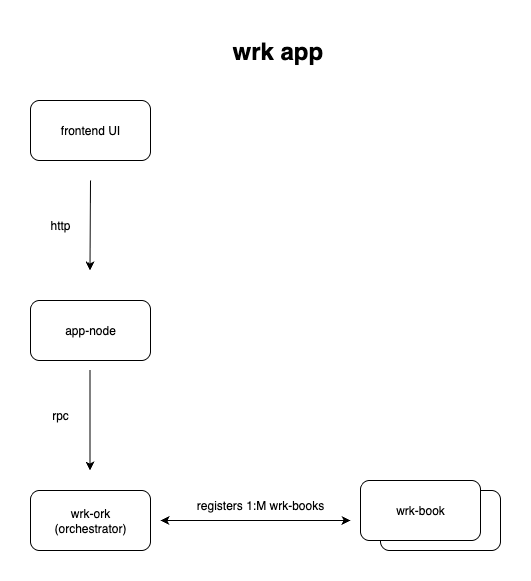
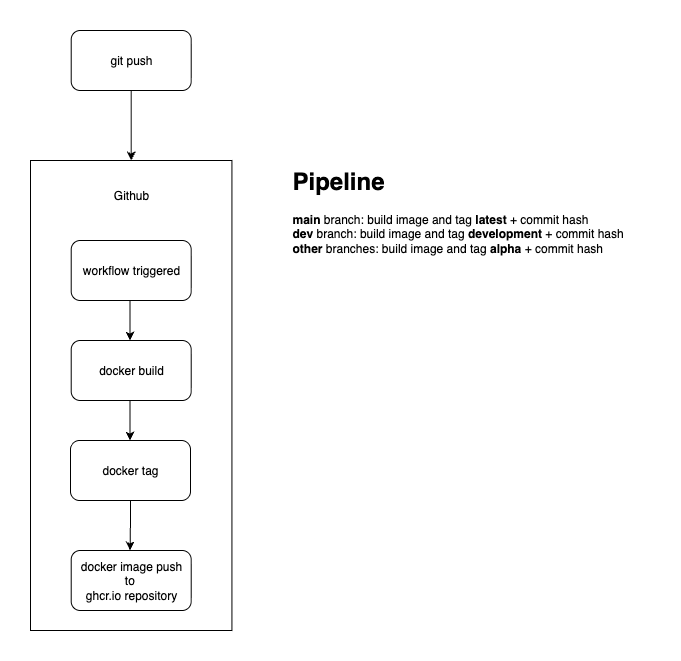

# wrk-docs

Documentation for the wrk project.

### Shared Libraries

- https://github.com/rob-j-au/tpl-wrk-thing
- https://github.com/rob-j-au/wrk-base

### Applications

- https://github.com/rob-j-au/wrk-book
- https://github.com/rob-j-au/wrk-ork
- https://github.com/rob-j-au/app-node

### Docker

#### Dockerfiles

- https://github.com/rob-j-au/wrk-book/blob/main/Dockerfile
- https://github.com/rob-j-au/wrk-ork/blob/main/Dockerfile
- https://github.com/rob-j-au/app-node/blob/main/Dockerfile

#### Github Docker Build & Push Workflows

- https://github.com/rob-j-au/wrk-book/blob/main/.github/workflows/docker.yml
- https://github.com/rob-j-au/wrk-ork/blob/main/.github/workflows/docker.yml
- https://github.com/rob-j-au/app-node/blob/main/.github/workflows/docker.yml

#### Docker Images

- https://github.com/rob-j-au/wrk-book/pkgs/container/wrk-book%2Fwrk-book
- https://github.com/rob-j-au/wrk-ork/pkgs/container/wrk-ork%2Fwrk-ork
- https://github.com/rob-j-au/app-node/pkgs/container/app-node%2Fapp-node

### Docker Compose Stack

- https://github.com/rob-j-au/wrk-compose

### Architecture

#### Diagram

#### Github Pipeline

